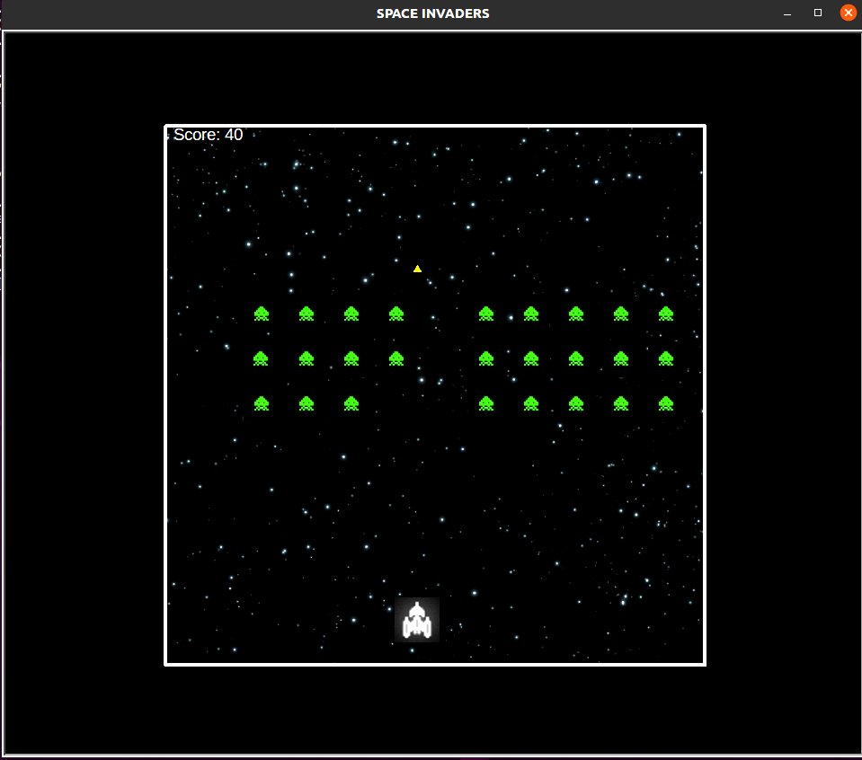

# Space-Invaders

<p align="center"></p>

## Installing tools

In this we will be basically using Python 3 and turtle shell.
having thought everyone is having python 3... just type the following command in the terminal to install Tkinter & Turtle.
```bash
sudo apt-get install python3-tk
```
this is for linux users as am using in terminal in ubuntu.

## Getting started
We will be using turtle to create all the characters and also for the borders for the game design.

```bash
import turtle
import os
```
start creating the window for the game to pop up and the borders for it.
and for the game to stay there and not to dissapear use:
```bash
delay = input("press enter to terminate...")
```
so as the game pop's up..it will only terminaate if pressed Enter in the terminal

wn.register_shape is used to assign the images to the characters in game:
```bash
wn.register_shape("invader.gif")
```
remember that to access these images into the python code, they have to be in the same folder as the code is saved.

* The input images should be in GIF format.
* i specifically resized the background image to (600x600) pixels.
Now create the border using the turtle module as shown.

I tried to bring the game design in the centre so i used the following co ordinated to do it as:
```bash
border_pen.setposition(-300, -300)
```

## Configuring keyboard controls to characters

use the following turtle functions:
```bash
turtle.listen() #to detect the keyboard bindings
turtle.onkey(left, "Left") #reacts to the key presses
turtle.onkey(right, "Right")
turtle.onkey(fire_bullet, "space")
```

## Creating characters for the game

As above create the characters in a similar to that of the border design.

Creation of the ship is pretty simple; you can import the desired image as:
```bash
ship.shape("ship.gif")
```
and as it has to be moved only in the x-direction; the position can be as follows:
```bash
ship.setposition(0,-250)
```
and to encounter the case where the ship goes out of the border line... create a new user defined function to create the limitation:
```bash
def left():
	x = ship.xcor() #you take x co ordinate
	x -= ship_move
	if x < -280: #this condition is for the triangle not to cross the boundary
		x = -280
	ship.setx(x) #fix the new co ordinate
```
create a similar function for the ship not to cross the right side border.

and also give the shipe_move(ship speed) to deterine how fast the ship will go as per our clicking.

Now creating multiple enemies... moving in a row as per old space invaders..

crete an empty list for the user to determine the number of enimies, and as it is in a row we have to given the position for the enimies to start in x and y directions as:
```bash
for i in range(number_of_enemies):
	enemies.append(turtle.Turtle())

enemy_start_x = -200
enemy_start_y = 250
```
do as follows to create rows of enemy ships:
```bash
  x = enemy_start_x + (50 * enemy_number)
	y = enemy_start_y
	enemy.setposition(x, y)
	enemy_number += 1
	if enemy_number == 10:
		enemy_start_y -= 50
		enemy_number = 0
```
give the speed for enemy ships to move as well...

The function of the bbullet is a bit complicated than the rest of the two characters; create bullet similar to that of other characters using turtle module and give it a speed to move.

ther are two states for the bullet:
"ready and fire"... we dont want multiple bullets to be fired without the earlier one to cross the border fast.. if you want to have multiple bullets you can increase the speed of the bullet. It wouldnt make much difference.

initialize the bullet state to be ready at first:
```bash
bulletstate = "ready"
```
create a user defined function for the condition in which we fire the bullet:
```bash
def fire_bullet():
	global bulletstate
	if bulletstate == "ready":
		bulletstate = "fire"
		x = ship.xcor()
		y = ship.ycor() + 15
		bullet.setposition(x,y)
		bullet.showturtle()
```
create a function also for the collision to happen.. we kill the enemies only if we collide...so:
```bash
def isCollision(t1, t2):
	distance = math.sqrt(math.pow(t1.xcor() - t2.xcor(), 2) + math.pow(t1.ycor() - t2.ycor(),2))
	if distance < 15:
		return True
	else:
		return False
```
Finally score panel:
it is same as the other characters using turtle module.
This can be the score panel postion:
```bash
score_pen.setposition(-290, 280)
```
and let the score be a string; initialized with score = 0
```bash
scorestring = "Score: %s" %score
score_pen.write(scorestring, False, align = "left", font = ("Arial", 14, "normal"))
```
## Main Game Loop

all of that is defined is used in this While Loop
the while loop is created in the condition to be "True".. so that it is continued until is breaked by a specific condition.

* specifically in the loop use this to spped up the process.. otherwise as the number of enimies increase the process gets slower.
```bash
wn.update()
```
follow the code as per the enemy movements and also for the enemies to move simultaneously down ..(together).
the colloision function is also used in the loop for the score panel.. to increase its count...

Use "score_pen.clear()" to clear the score after every collision to write a new one in the string.

The condition for the game to end is :
```bash
if isCollision(ship,enemy):
			ship.hideturtle()
			enemy.hideturtle()
			print("GAME OVER")
			break
```
So if this collision occurs then the loop will break and the "GAME OVER" will be displayed in the terminal.

And also remember the bulletstate to reset it to fire and ready as it crosses the border... using an if condition.

## THAT IS ALL IT IS TO BE DONE...

  
